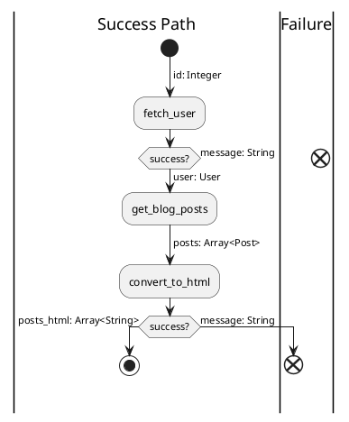

# Railway :: Basic Usage

`Flows::Railway` is an implementation of a Railway Programming pattern. You may read about this pattern in the following articles:

* [Programming on rails: Railway Oriented Programming](http://sandordargo.com/blog/2017/09/27/railway_oriented_programming) // it's not about Ruby on Rails
* [Railway Oriented Programming: A powerful Functional Programming pattern](https://medium.com/@naveenkumarmuguda/railway-oriented-programming-a-powerful-functional-programming-pattern-ab454e467f31)
* [Railway Oriented Programming in Elixir with Pattern Matching on Function Level and Pipelining](https://medium.com/elixirlabs/railway-oriented-programming-in-elixir-with-pattern-matching-on-function-level-and-pipelining-e53972cede98)

Let's review a simple task and solve it using `Flows::Railway`: you have to get a user by ID, get all user's blog posts and convert it to an array of HTML-strings. In such situation, we have to implement three parts of our task and compose it into something we can call, for example, from a Rails controller. Also, the first and third steps may fail (user not found, conversion to HTML failed). And if a step failed - we have to return failure info immediately. Let's draw this using a UML activity diagram:



And implement using `Flows::Railway`:

```ruby
class RenderUserBlogPosts
  include Flows::Railway

  step :fetch_user
  step :get_blog_posts
  step :convert_to_html

  def fetch_user(id:)
    user = User.find_by_id(id)
    user ? ok(user: user) : err(message: "User #{id} not found")
  end

  def get_blog_posts(user:)
    ok(posts: User.posts)
  end

  def convert_to_html(posts:)
    posts_html = post.map(&:text).map do |text|
      html = convert(text)
      return err(message: "cannot convert to html: #{text}")
    end

    ok(posts_html: posts_html)
  end

  private

  # returns String or nil
  def convert(text)
    # some implementation here
  end
end
```

And execute it:

```ruby
# User with id = 1 exists and with id = 2 - doesn't

RenderUserBlogPosts.new.call(id: 1)
# => Flows::Result::Ok.new(posts_html: [...])

RenderUserBlogPosts.new.call(id: 2)
# => Flows::Result::Err.new(message: 'User 2 not found')
```

## Flows::Railway rules

* steps execution happens from the first to the last step
* input arguments (`Railway#call(...)`) becomes the input of the first step
* each step should return Result Object (`Flows::Result::Helpers` already included)
* if step returns failed result - execution stops and failed Result Object returned from Railway
* if step returns successful result - result data becomes arguments of the following step
* if the last step returns successful result - it becomes a result of a Railway execution

## Defining Steps

Two ways of step definition exist. First is by using an instance method:

```ruby
step :do_something

def do_something(**arguments)
  # some implementation
  # Result Object as return value
end
```

Second is by using lambda:

```ruby
step :do_something, ->(**arguments) { ok(some: 'data') }
```

Definition with lambda exists primarily for debugging/testing purposes. I recommend you to use method-based implementations for all your business logic. Also, this is good for consistency, readability, and maintenance. __Think about Railway as about small book: you have a "table of contents" in a form of step definitions and actual "chapters" in the same order in a form of public methods. And your private methods becomes something like "appendix".__

## Dependency Injection

By default, we search for step implementation methods in a class instance. But you may override method source and inject your own:

```ruby
class SayOk
  include Flows::Railway

  step :do_job
end

module Loud
  extend Flows::Result::Helpers

  def self.do_job
    ok(text: 'OOOOKKKK!!!!')
  end
end

module Normal
  extend Flows::Result::Helpers

  def self.do_job
    ok(text: 'ok')
  end
end

SayOk.new(method_source: Loud).call.unwrap
# => { text: 'OOOOKKKK!!!!' }

SayOk.new(method_source: Normal).call.unwrap
# => { text: 'ok' }
```

When you change your method source original class is no longer used for methods lookup. But what if we want to just override one of the steps? We can:

```ruby
class SayOk
  include Flows::Railway

  step :do_job

  def do_job
    ok(text: 'ok')
  end
end

say_loud = -> { ok(text: 'OOOOKKKK!!!!') } # or anything with implemented #call method

SayOk.new.call.unwrap
# => { text: 'OOOOKKKK!!!!' }

SayOk.new(deps: { do_job: say_loud }).call.unwrap
# => { text: 'ok' }
```

Moreover, you can mix both approaches. Injecting using `deps:` has higher priority.

## Pre-building and Performance

As mentioned before, railway execution consists of two phases: build (`.new`) and run (`#call`). And the build phase is expensive. You may compare overheads when you build a railway each time:

```
$ WITH_RW=1 bin/benchmark

--------------------------------------------------
- task: A + B, one step implementation
--------------------------------------------------
Warming up --------------------------------------
Flows::Railway (build once)
                        30.995k i/100ms
Flows::Railway (build each time)
                        11.553k i/100ms
Calculating -------------------------------------
Flows::Railway (build once)
                        347.682k (± 2.1%) i/s -      1.767M in   5.083828s
Flows::Railway (build each time)
                        122.908k (± 4.2%) i/s -    623.862k in   5.085459s

Comparison:
Flows::Railway (build once):   347681.6 i/s
Flows::Railway (build each time):   122908.0 i/s - 2.83x  slower


--------------------------------------------------
- task: ten steps returns successful result
--------------------------------------------------
Warming up --------------------------------------
Flows::Railway (build once)
                         6.130k i/100ms
Flows::Railway (build each time)
                         2.168k i/100ms
Calculating -------------------------------------
Flows::Railway (build once)
                         63.202k (± 1.6%) i/s -    318.760k in   5.044862s
Flows::Railway (build each time)
                         21.645k (± 3.6%) i/s -    108.400k in   5.014725s

Comparison:
Flows::Railway (build once):    63202.5 i/s
Flows::Railway (build each time):    21645.2 i/s - 2.92x  slower
```

As the benchmark shows your infrastructure code overhead from Flows will be almost three times lower when you build your railways at 'compile' time. I mean something like that:

```ruby
class MyClass
  MY_RAILWAY = MyRailway.new # this string will be executed on a class loading stage

  def my_method
    MY_RAILWAY.call
  end
end
```

But if you don't care much about performance - build each time will be fast enough. Check out [Performance](overview/performance.md) page to see a bigger picture.
