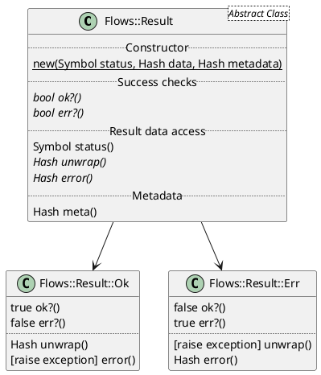

# Basic Usage

Result Object is a way of presenting result of some calculation. Result may be successful or failure.
For example, if you calculate expression `a / b`:

* for `a = 6` and `b = 2` result will be successful with data `3`.
* for `a = 6` and `b = 0` result will be failure with data, for example, `"Cannot divide by zero"`.

Examples of such approach may be found in other libraries and languages:

* [Either Monad](https://hackage.haskell.org/package/category-extras-0.52.0/docs/Control-Monad-Either.html) in Haskell
* [Result Type](https://doc.rust-lang.org/std/result/enum.Result.html) in Rust
* [Faraday gem](https://www.rubydoc.info/gems/faraday/Faraday/Response) has `Faraday::Response` object which contains data and status
* [dry-rb Result Monad](https://dry-rb.org/gems/dry-monads/result/) has `Dry::Monads::Result`

So, why you need Result Object? Why not just return `nil` on failure or raise an error (like in standard library)? There are some reasons:

* raising errors and exceptions isn't very convenient and explicit way to handle errors. Moreover it's slow and feels like `goto`. But it's still a good way to abort execution when unexpected error happens.
* returning `nil` does not work when you have to deal with different type of errors or error has some data payload.
* using specific Result Objects (like `Faraday::Response`) brings inconsistency - you have to learn how to deal with each new type of Result.

That's why `Flows` should have Result Object implementation. If any executable Flows entity will return Result Object with same API - wiring between your app components becomes trivial. Also, Result Objects should be fast and lightweight as possible.

Flows' implementation inspired mainly by [Rust Result Type](https://doc.rust-lang.org/std/result/enum.Result.html) and focused on following features:

* use idiomatic Ruby: no methods named with first capital letter (`Name(1, 2)`), etc.
* provide convenient helpers for `case` and `===` (case equality) for matching results and writing routing logic
* provide helpers for convenient creation of Result Objects
* Result Object may be successful (`Ok`) or failure (`Err`)
* Result Object has an status (some symbol: `:saved`, `:zero_division_error`)
* status usage is optional. Default statuses for successful and failure results are `:success` and `:failure`
* result may have metadata. Metadata is something unrelated to your business logic (execution time, for example, or some info about who created this result).
* different accessors for successful and failure results - prevents treating failure results as successful and vice versa.

## Class Diagram

Class UML diagram describing current implementation:



## Creating Results

Most flexible and verbose way of creating Result Objects is creating via `.new`:

```ruby
# Successful result with data {a: 1}
Flows::Result::Ok.new(a: 1)

# Failure result with data {msg: 'error'}
Flows::Result::Err.new(msg: 'error')

# Successful result with data {a: 1} and status `:done`
Flows::Result::Ok.new({ a: 1 }, status: :done)

# Failure result with data {msg: 'error'} and status `:http_error`
Flows::Result::Err.new({ msg: 'error' }, status: :http_error)

# Successful result with data {a: 1} and metadata `{ time: 123 }`
Flows::Result::Ok.new({ a: 1 }, meta: { time: 123 })

# Failure result with data {msg: 'error'} and metadata `{ time: 123 }`
Flows::Result::Err.new({ msg: 'error' }, meta: { time: 123 })
```

More convenient and short way is to use helpers:

```ruby
include Flows::Result::Helpers

# Successful result with data {a: 1}
ok(a: 1)

# Failure result with data {msg: 'error'}
err(msg: 'error')

# Successful result with data {a: 1} and status `:done`
ok(:done, a: 1)

# Failure result with data {msg: 'error'} and status `:http_error`
err(:http_error, msg: 'error')
```

You cannot provide metadata using helpers and it's ok: you shouldn't populate metadata in your business code.
Metadata is designed to use in library code and when you have to provide some metadata from your library - just use `.new` instead of helpers.

## Inspecting Results

Behaviour of any result object:

```ruby
result.status # returns status, example: `:success`

result.meta # returns metadata, example: `{}`
```

Behaviour specific to successful results:

```ruby
result.ok? # true

result.err? # false

result.unwrap # returns result data

result.error # raises exception
```

Behaviour specific to failure results:

```ruby
result.ok? # false

result.err? # true

result.unwrap # raises exception

result.error # returns result data
```

## Matching Results

Basic matching results using `case`:

```ruby
case result
when Flows::Result::Ok then do_job
when Flows::Results::Err then give_up
end
```

But this is too verbose. For this case helpers has methods for matching. Example above may be rewritten like this:

```ruby
include Flows::Result::Helpers

case result
when match_ok then do_job
when match_err then give_up
end
```

Moreover, you may specify status when using helper matchers:

```ruby
include Flows::Result::Helpers

case result
when match_ok(:create) then do_create
when match_ok(:update) then do_update
when match_err(:http_error) then retry
when match_err then give_up
end
```

## General Recommendations

Let's assume that you have some code returning Result Object.

* if error happened and may be handled somehow - return failure result
* if error happened and cannot be handled - raise exception to abort execution
* if you don't handle any errors for now - don't check result type and use `#unwrap` to access data. It will raise exception when called on a failure result.
